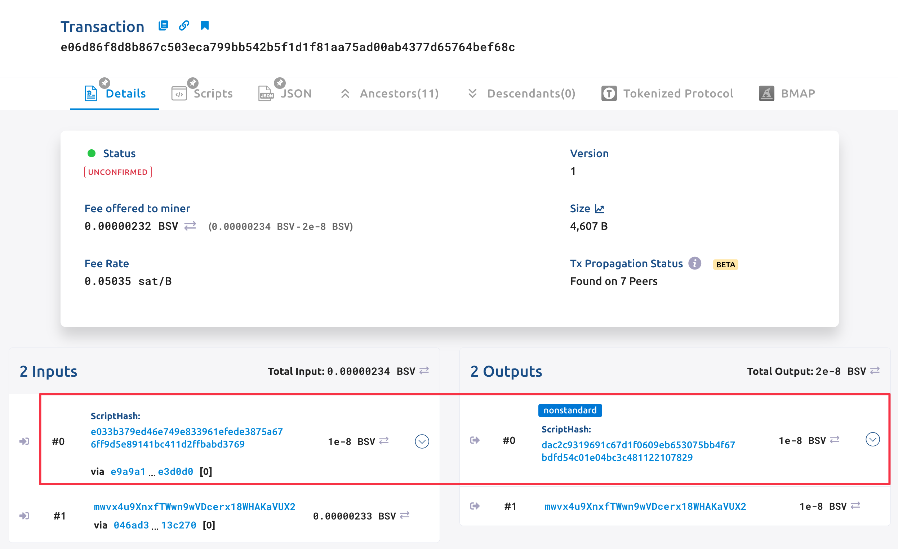

# Sighash in `@method()`

In this section, we will introduce how to specify different sighash types in the `@method()` decorator.

:::note
Sighash here only affects contracts that access `ScriptContext` in their public methods.
:::note

#### Counter

Let us use the [Counter](../how-to-write-a-contract/stateful-contract.md) contract as an example. It simply records how many times it has been called since deployment.

Noted that the `@method` [decorator](../how-to-write-a-contract/how-to-write-a-contract.md#method-decorator) takes a sighash type as a parameter, whose default is `ALL`. According to the [doc](../how-to-write-a-contract/scriptcontext.md#sighash-type),  `hashOutputs` is the double SHA256 of the serialization of **all outputs** when the sighash type is `ALL`. The [default calling transaction builder](../how-to-deploy-and-call-a-contract/how-to-customize-a-contract-tx.md#default-1) adds a change output when necessary. That's why we need to add a change output when building outputs of the spending transaction in the public method: we need to build all the outputs that are included in `hashOutputs`. Otherwise, contract call will fail.

The following [transaction](https://test.whatsonchain.com/tx/845f22b728deb23acacbc6f58f23ffde9c3e2be976e08c57f2bdcb417e3eacc5) is a contract calling transaction of `Counter`. As you can see, it contains two outputs: one for the new state, the other for change.


#### Advanced Counter

Noted that in the state transition of `Counter`, there is always only one UTXO that contains the latest contract state. When the contract is called, it spends the UTXO of the current state and creates a UTXO of the new state. Moreover, the contract input index of the spending transaction and the contract output index are the same.

In fact, we only care about the contract-related UTXO in the transaction inputs and outputs when calling Counter, and do not care about other inputs and outputs. Thus, we can use `SINGLE | ANYONECANPAY` to simplify the contract.
`SINGLE` lets us focus on the contract output itself.
`ANYONECANPAY` allows anyone to add inputs for this contract calling transaction to, e.g., pay fees.


We make two changes to the original Counter.

1. Using `@method(SigHash.ANYONECANPAY_SINGLE)`
2. Build an `output` that only contains the contract's new state, without the change output.

```ts
export class AdvancedCounter extends SmartContract {
    ...
    
    // 1) add ANYONECANPAY_SINGLE
    @method(SigHash.ANYONECANPAY_SINGLE)
    public incrementOnChain() {
        ...
        
        const amount: bigint = this.ctx.utxo.value
        // 2) remove change output
        const output: ByteString = this.buildStateOutput(amount)
        assert(this.ctx.hashOutputs == hash256(output), 'hashOutputs mismatch')
    }
    
    ...
}
```

You can check the [complete code here](https://github.com/sCrypt-Inc/boilerplate/blob/master/src/contracts/advancedCounter.ts).

The following [transaction](https://test.whatsonchain.com/tx/e06d86f8d8b867c503eca799bb542b5f1d1f81aa75ad00ab4377d65764bef68c) is a contract calling transaction of `AdvancedCounter`. You can see it also contains two outputs, but we only use one output when checking if it hashes to `hashOutputs` in the public method, since we use `SINGLE`.



## More examples

Use different sighash types in `@method()` decorator will change the value of `ScriptContext`. This is useful in many cases.

- If your contract needs to restrict all inputs and outputs of the spending transaction, use `ALL`.
- If your contract is stateful and the state is always in a single output, simplify it using `SINGLE`.
- If you want to enable someone else could add inputs after the transaction is sealed, such as for paying transaction fees, apply the `ANYONECANPAY` modifier.

You can check find examples in our [boilerplate](https://github.com/sCrypt-Inc/boilerplate).

- [AnyoneCanSpend](https://github.com/sCrypt-Inc/boilerplate/blob/master/src/contracts/acs.ts)
- [Clone](https://github.com/sCrypt-Inc/boilerplate/blob/master/src/contracts/clone.ts)
- [ERC20](https://github.com/sCrypt-Inc/boilerplate/blob/master/src/contracts/erc20.ts)
- [ERC721](https://github.com/sCrypt-Inc/boilerplate/blob/master/src/contracts/erc721.ts)
- [OrdinalLock](https://github.com/sCrypt-Inc/boilerplate/blob/master/src/contracts/ordinalLock.ts)
