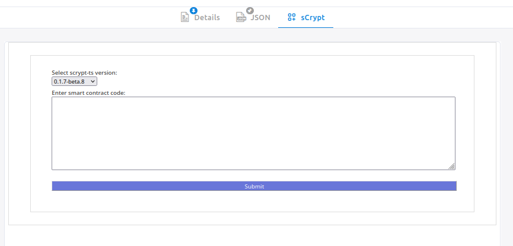
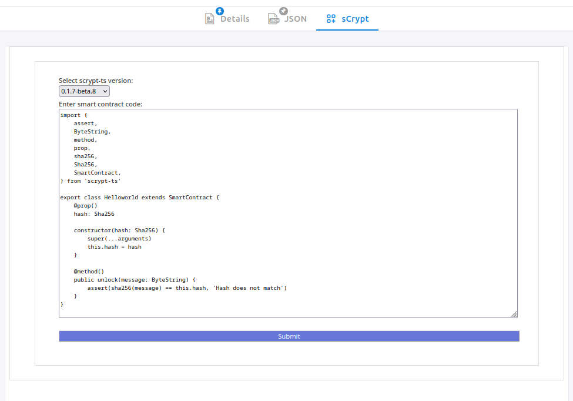
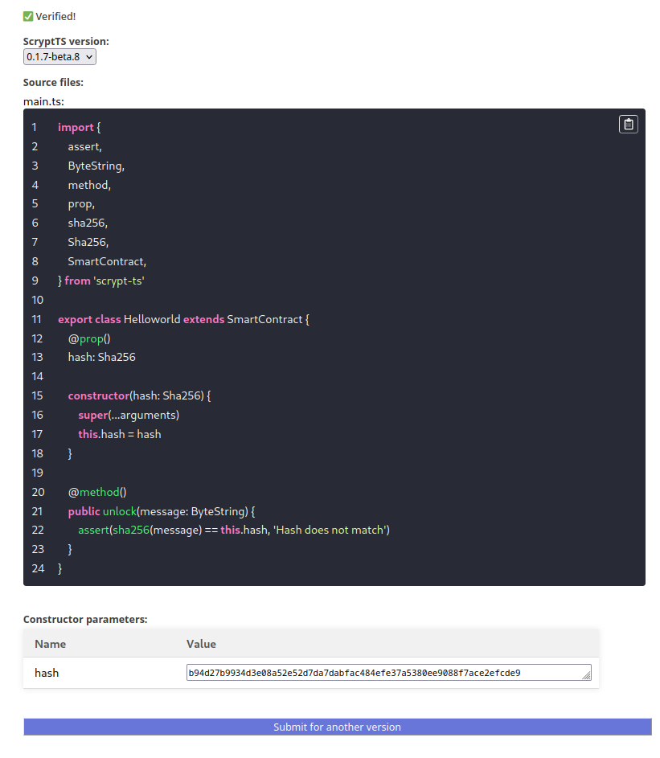

# How to Verify a Contract

You will learn how to verify smart contracts on [WhatsOnChain](https://whatsonchain.com/) (WoC).
By verifying your smart contract on WoC, anyone can view its source code and interact with it confidently. Let's get started!

To start with the verification process, we need to first deploy a smart contract. Let us use the ["Hello World" tutorial](./tutorials/hello-world.md) as an example. After you complete the tutorial, you should get the ID of the deployment transaction such as[`a34d4e45a9108b5b9da4faf4f086e9ef36b79466383bd7a22ff2c7f6a562546c`](https://test.whatsonchain.com/tx/a34d4e45a9108b5b9da4faf4f086e9ef36b79466383bd7a22ff2c7f6a562546c).

If you take a look at the transaction on WoC, you'll see that the first output contains a script identified by the hash `eb2f10b8f1bd12527f07a5d05b40f06137cbebe4e9ecfb6a4e0fd8a3437e1def`, which contains your contract in script format.

You can submit and verify sCrypt source code that compiles to it.

## Submitting the Source Code

At the deployed transaction, click on the `ScriptHash` of the first output. It will open a page like this:

You shall see an `sCrypt` tab. Click on it. You'll see a very simple form:

In the form you are able to select the version of sCrypt you've used to compile and deploy the contract, along with a text-box in which you need to paste the source code.

Now click `Submit`. If the code is correct, you should see something like the following in a few seconds:

Congrats, you have verified your first smart contract!

Now, every time someone opens the `sCrypt` tab on [the script hash page](https://test.whatsonchain.com/script/eb2f10b8f1bd12527f07a5d05b40f06137cbebe4e9ecfb6a4e0fd8a3437e1def), they will see the verified smart contract source code, as well as its constructor parameters when deployed.