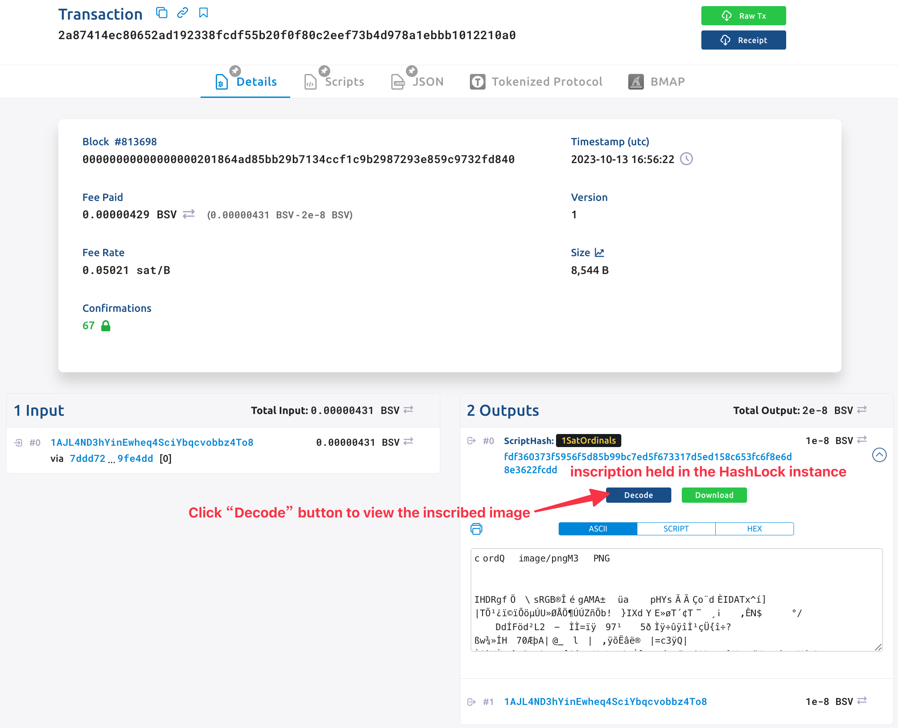
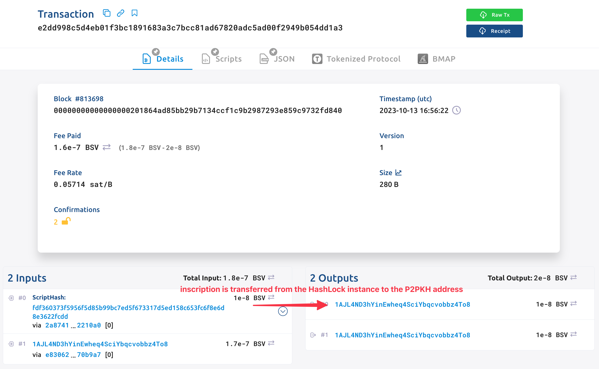

# Tutorial 8: Inscribe Image

## Overview

In this tutorial, we will use contract [HashPuzzle](https://github.com/sCrypt-Inc/boilerplate/blob/master/src/contracts/hashPuzzle.ts) as an example, to introduce how to inscribe an image with [sCrypt](https://scrypt.io/) and transfer the [1Sat Ordinals](https://docs.1satordinals.com/) inscription with a Smart Contract.

**Note**: The contract instance must be funded with some BSV before inscribing the image.


To enable all these features, you should install `scrypt-ord` as an dependency in your project.

```bash
npm install scrypt-ord
```

## Contract

The new contract `HashPuzzleNFT` is almost the same as the previous [implementation](https://github.com/sCrypt-Inc/boilerplate/blob/master/src/contracts/hashPuzzle.ts), except it must be derived from `OneSatNFT` instead of `SmartContract`.

```ts
class HashPuzzleNFT extends OneSatNFT {
    ...
}
```

The contract also stores a hash value in the contract, and it will be unlocked successfully when calling the public method `unlock` with the correct message.

```ts
class HashPuzzleNFT extends OneSatNFT {
    @prop()
    hash: Sha256
    
    @method()
    public unlock(message: ByteString) {
        assert(this.hash == sha256(message), 'hashes are not equal')
    }
    
    ...
}
```

The base class `OneSatNFT` encapsulated helper functions to handle inscriptions. If you want to create your own contract that can interact with the inscription, derive from it.

## Inscribe Image

Things get easier. We first create an instance of contract `HashPuzzleNFT`, then call `inscribeImage` on the instance to inscribe an image.

```ts
// create contract instance
const message = toByteString('Hello sCrpyt', true)
const hash = sha256(message)
const hashPuzzle = new HashPuzzleNFT(hash)
...
// inscribe image into contract
const image = readImage()
const mintTx = await hashPuzzle.inscribeImage(image, 'image/png')
```

Execute command `npx ts-node tests/examples/inscribeImage.ts` to run this example.


Then you can check your inscription on the explorer.





Normally, we use a P2PKH address to receive the inscription, then the inscription is controlled by a private key the same as the general P2PKH.

In this example, the inscription is sent to a contract instance, it is controlled by the smart contract, which means it can only be transferred when the hash puzzle is solved.

## Transfer the Inscription

For now, the contract instance holds the inscription and we try to transfer it to a P2PKH address.

### Step 1. Create Receiver Instance

Class `OneSatNFTP2PKH` represents a P2PKH address that can hold inscriptions. Its constructor takes one parameter which is the receiving address.

```ts
const receiver = new OneSatNFTP2PKH(Addr(receiverAddress.toByteString()))
```

### Step 2. Call the Contract

Just as other [contract calling](../how-to-deploy-and-call-a-contract/how-to-deploy-and-call-a-contract.md#contract-call) methods we introduced before, we call the public method `unlock` of `HashPuzzleNFT` as follows.

```ts
const { tx: transferTx } = await hashPuzzle.methods.unlock(
    message,
    {
        transfer: receiver,
    } as MethodCallOptions<HashPuzzleNFT>
)
```

To represent the receiver, we only need to pass the receiver instance to the key `transfer` of struct `MethodCallOptions`.

### Benefits of Using Smart Contracts
Smart Contracts offer a number of benefits for inscribing and transferring inscriptions, including:

The ability to create complex and efficient transactions. For example, we could use a Smart Contract to create a marketplace for inscriptions, where buyers and sellers can interact in a secure and trustless manner.

The ability to implement custom logic. For example, we could use a Smart Contract to create a voting system, where users can vote on inscriptions using their BSV.

Overall, Smart Contracts offer a powerful and flexible way to interact with inscriptions on the BSV blockchain.

## Conclusion

Great! You have finished the tutorial on how to inscribe and transfer the 1Sat Ordinals inscription with a Smart Contract.

The full complete [contract](https://github.com/sCrypt-Inc/scrypt-ord/blob/master/tests/contracts/hashPuzzleNFT.ts) and [example](https://github.com/sCrypt-Inc/scrypt-ord/blob/master/tests/examples/inscribeImage.ts) can be found in sCrypt's [repository](https://github.com/sCrypt-Inc/scrypt-ord).
